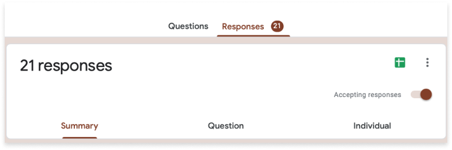
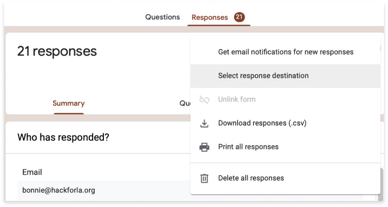
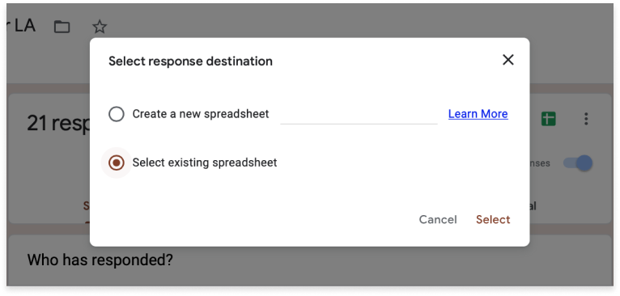
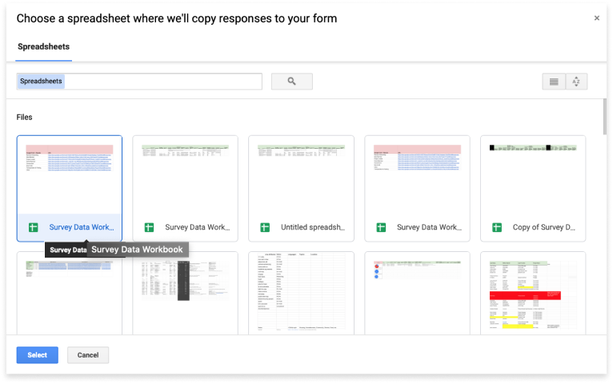

  <h3 id="link-to-google"> Link Google Form to Google Sheets</h3>
  <h5>Link your survey results to a designated Google Sheets workbook</h5>
  <h5 class="pink-header">Select Response Destination</h5>
  
Click the vertical elipsis located at the top right of the survey form

  

    
    <!-- Arrows and Overlay Text Links -->
    <!-- RIGHT SIDE LINKS -->
    
    <h4><a href="#" class="elipsis">VERTICAL ELIPSIS</a></h4>
     
    
    <!-- Arrows and Overlay Text Links -->
    <!-- RIGHT SIDE LINKS -->
    
    <h4><a href="#" class="elipsis">SELECT RESPONSE DESTINATION</a></h4>
     
    
    <!-- Arrows and Overlay Text Links -->
    <!-- LEFT SIDE LINKS -->
    
    <h4><a href="#" class="elipsis">SELECT EXISTING SPREADSHEET</a></h4>
     
    
    <!-- Arrows and Overlay Text Links -->
    <!-- LEFT SIDE LINKS -->
    
    <h4><a href="#" class="elipsis">SELECT TARGET SHEET</a></h4>

  <h3>Clean Data in Google Sheets </h3>
  <h5>Clean the data exported by your Google Form to enable proper manipulation in Google Data Studio</h5>

    

