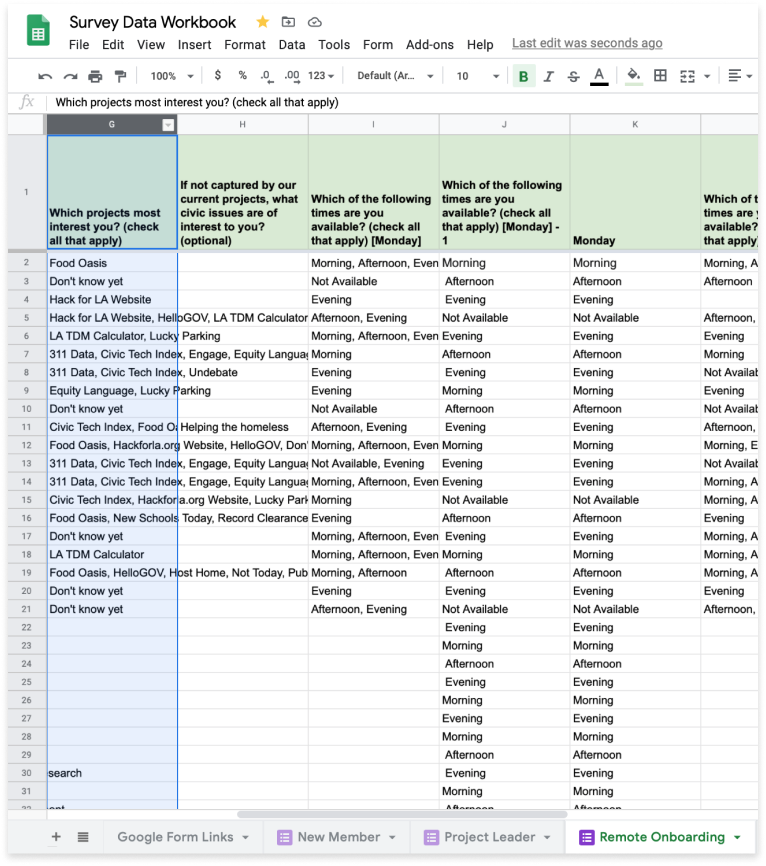

  <h3 id="link-to-google"> Link Google Form to Google Sheets</h3>
  
Link your survey results to a designated Google Sheets workbook

  <h4 class="title-section">Select Response Destination</h4>
  
Click the vertical elipsis located at the top right of the survey form

  

    
    <!-- Arrows and Overlay Text Links -->
    <!-- RIGHT SIDE LINKS -->
    
    <h4><a href="#" class="elipsis">VERTICAL ELIPSIS</a></h4>
     
    
    <!-- Arrows and Overlay Text Links -->
    <!-- RIGHT SIDE LINKS -->
    
    <h4><a href="#" class="select-response-and-destination">SELECT RESPONSE DESTINATION</a></h4>
     
    
    <!-- Arrows and Overlay Text Links -->
    <!-- LEFT SIDE LINKS -->
    
    <h4><a href="#" class="elipsis">SELECT EXISTING SPREADSHEET</a></h4>
     
    
    <!-- Arrows and Overlay Text Links -->
    <!-- LEFT SIDE LINKS -->
    
    <h4><a href="#" class="select-target-sheet">SELECT TARGET SHEET</a></h4>
  

  <h3 id="clean-data-google-sheets">Clean Data in Google Sheets </h3>
  <h5>Clean the data exported by your Google Form to enable proper manipulation in Google Data Studio</h5>
  <h4 class="title-section" >Format Spreadsheet </h4>
  

    Once you have set the response destination for your Google Form to your desired Google Sheets File, your data will be visible in a new worksheet.   
    (1) Choose a short, yet descriptive title for your worksheet. If your spreadsheet contains multiple worksheets, move the new tab to the desired location by dragging and dropping using the tab selector.   
    (2) Format the first row of data. Select the first row, then go to Format -> Text Wrapping -> Wrap.   
    (3) Select the first row and set the font to bold. Add a background color to further set the column titles off from the rows of data below.
  

    
    <!-- Arrows and Overlay Text Links -->
    <!-- LEFT SIDE LINKS -->
    
    <h4><a href="#" class="format-spreadsheet">ROW 1</a></h4>
    
    <h4><a href="#" class="format-spreadsheet">LINKED WORKSHEET TAB</a></h4>
    <h4 class="title-section">CREATE NEW COLUMNS</h4>
    
 
      Depending on the way your data is structured within a particular column, you will need to insert columns in order to clean your data for processing.   
      In most cases, where data is formatted as a list within a cell, this can be accomplished through the insertion of 2 new columns to the right of your target column data.   
      (1) Select the target column (‘G’). As a shortcut, select the column that immediately precedes as well (‘F’).   
      (2) In the Go to the Insert menu -> choose ‘2 Columns right.’
    

    
    <h4 class="title-section">TITLE NEW COLUMNS</h4>
    

      Once you have created your new columns to clean your data, title the new columns the same title as your target column with an appendage, such as “- 1” and “- 2”. This will distinguish your new columns from your target column
    

    
    <h4 class="title-section">TRANSPOSE ROW DATA</h4>
    

      To create a chart, whether direclty in Google Sheets, or by using a data visualization tool like Google Data Studio, we must have a 1:1 relationship between the data in a particular cell and its dimension (column name). By default, survey questions of the “check all that apply” variety produce data arrays that violate this principle.   

      We use the TRANSPOSE() function with the SPLIT() and JOIN() functions to achieve this outcome. In our example, we enter the formula =TRANSPOSE((SPLIT(JOIN(“,”, G2:G995), “,”))) in cell H2.   

      How did we choose G995 as the endpoint of our range? The parameter requires a defined end point; therefore, we arbitrarily choose a cell value beyond which we are certain no future values will be recorded.
    

    

    

